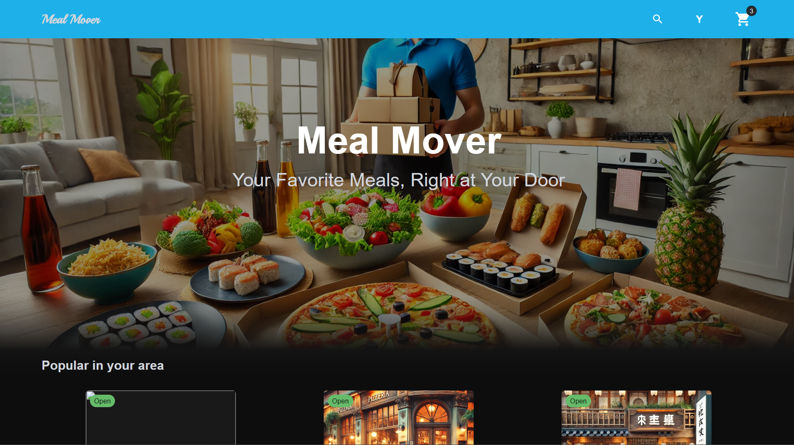
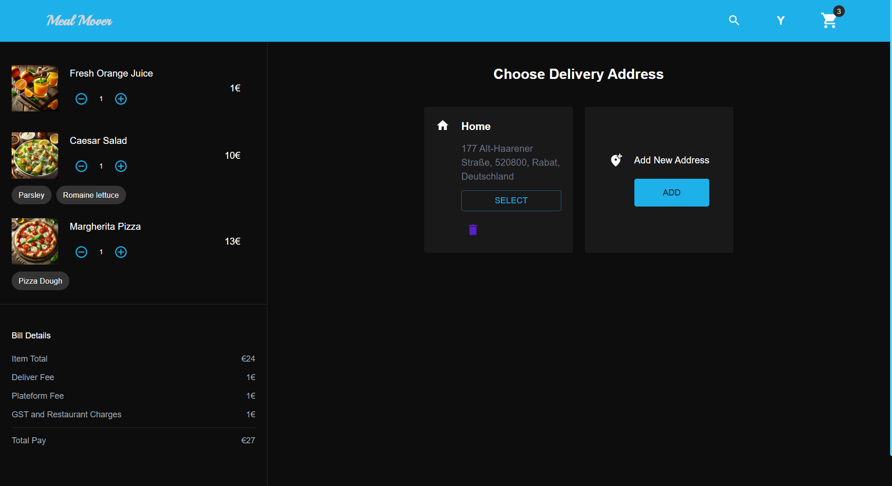
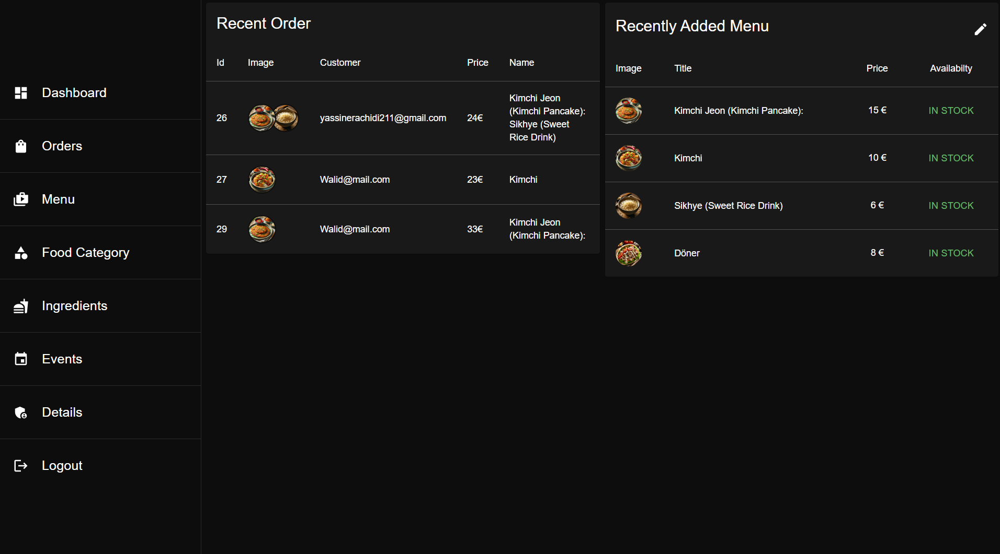

# 🍔 Food Ordering Website

## 🚀 Overview  
A **Full Stack Food Ordering Platform** developed as part of my **12-week Praxisprojekt** during my Bachelor’s degree, under the supervision of a professor at FH Aachen.  
The project enables users to browse restaurants, explore menus, manage carts, and complete secure online payments using **Stripe**.  

It combines a robust **Spring Boot backend** with a responsive **React + Redux + Tailwind** frontend, implementing **JWT authentication**, **role-based access**, and an intuitive **admin dashboard** for order and restaurant management.

---

## 🧩 Tech Stack

### **Frontend**
- ⚛️ React (Vite)
- 🗃️ Redux (state management)
- 🎨 Tailwind CSS
- 🔄 Axios (API communication)
- ⚙️ React Router (navigation)
- 💳 Stripe integration (real payments)

### **Backend**
- ☕ Spring Boot (Java)
- 🔐 Spring Security with JWT Authentication
- 🗄️ JPA / Hibernate (MySQL)
- 🧠 Layered Architecture (Controller → Service → Repository)
- 📦 Maven Project Structure

---

## 🗂️ Core Features

### 👤 **User Side**
- Register & Login with JWT authentication  
- Browse restaurants, food categories, and detailed menus  
- Add/remove items from cart using Redux state management  
- Place and pay for orders using Stripe checkout  
- Track order status (Pending → Accepted → Delivering → Delivered)  

### 🛠️ **Admin Side**
- Manage restaurants, categories, and food items  
- Manage ingredients for each food item  
- View and update order statuses in real time  

### ⚡ **Additional Features**
- Fully integrated Stripe payment workflow  
- JWT-based role management (Admin/User)  
- Responsive UI built with Tailwind CSS  
- RESTful API design with Spring Boot  

---

## 🧱 Backend Architecture

src/
├── controller/      # REST controllers (User, Food, Cart, Order, Stripe)
├── service/         # Business logic
├── repository/      # JPA Repositories
├── model/           # Entities (User, Food, Cart, Order, etc.)
├── dto/             # Data Transfer Objects
└── config/          # Security & CORS configuration

---

## 🎨 Frontend Structure

src/
├── pages/           # Main pages (Home, Menu, Cart, Checkout, Orders, Admin)
├── components/      # Reusable UI components
├── redux/           # Redux store, slices, and actions
├── api/             # Axios API services
└── styles/          # Tailwind setup and theme

---

## ⚙️ How to Run the Project

### **Backend**
cd backend  
mvn spring-boot:run  

### **Frontend**
cd frontend  
npm install  
npm start  

Backend: http://localhost:8080  
Frontend: http://localhost:3000  

Ensure you set your Stripe API keys in the backend configuration (e.g. application.properties).

---

## 📸 Preview  

  
  

---

## 💡 What I Learned
- Developing a complete full stack application from scratch  
- Integrating Stripe for secure payment processing  
- Applying Redux for predictable global state management  
- Implementing JWT authentication and role-based access control  
- Designing scalable REST APIs with Spring Boot  
- Building responsive, maintainable UIs with React and Tailwind CSS  
- Structuring and documenting real-world software for production use  

---

## 🧑‍💻 Author
**Yassine**  
🎓 Developed as part of my Bachelor’s Praxisprojekt at FH Aachen  
📍 Built with ❤️ using Spring Boot, React, Redux, and Stripe  
🔗 [GitHub Profile](https://github.com/yassine1237)
